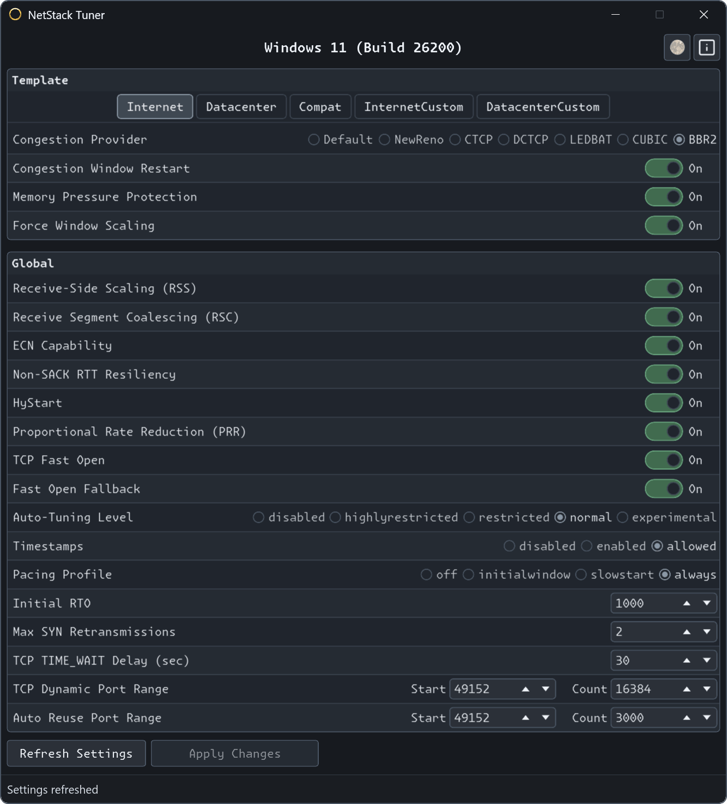

  # NetStack Tuner

NetStack Tuner is a small Windows GUI for inspecting and changing selected TCP template and global TCP stack settings. It is aimed at users who need a controlled way to tune Windows networking behavior without manually assembling `netsh`/PowerShell/registry commands.

## Highlights

- **Native desktop UI** built with Rust & Slint.
- **TCP template controls** for `Internet`, `Datacenter`, `Compat`, `InternetCustom`, and `DatacenterCustom`.
- **Congestion provider selection** including `Default`, `NewReno`, `CTCP`, `DCTCP`, `LEDBAT`, `CUBIC`, and `BBR2` where supported.
- **Global TCP controls** for RSS, RSC, ECN, timestamps, auto-tuning, initial RTO, non-SACK RTT resiliency, max SYN retransmissions, TCP Fast Open, HyStart, PRR, and pacing profile.
- **Dynamic port range editors** for the TCP dynamic port range and TCP auto-reuse port range.
- **Narrow registry support** for `TcpTimedWaitDelay`.
- **Batch apply workflow**.

## Supported Areas

NetStack Tuner currently focuses on TCP stack settings rather than adapter-driver tuning. It can inspect and modify:

- TCP supplemental/template settings.
- TCP global settings.
- TCP dynamic port range & TCP auto-reuse port range as paired start/count settings.
- `TcpTimedWaitDelay` under `HKLM\SYSTEM\CurrentControlSet\Services\Tcpip\Parameters`.

BBR2 is guarded behind Windows 11 22H2 / build `22621` or newer because older Windows builds do not expose usable BBR2 support.

## Safety Notes

- Network stack changes are system-wide and can affect every application on the machine.
- Some settings may require a reboot before Windows fully applies them.
- Record baseline values before experimenting so they can be restored.
- Avoid changing dynamic port ranges on production systems without understanding outbound connection volume and port reuse behavior.

## Disclaimer

NetStack Tuner is a configuration tool, not an automatic optimizer. The best TCP settings depend on Windows build, network adapter behavior, workload, path latency, and loss characteristics. Test changes deliberately & restore known-good values if behavior regresses.

---
*Note: This repository contains binary releases only.*
